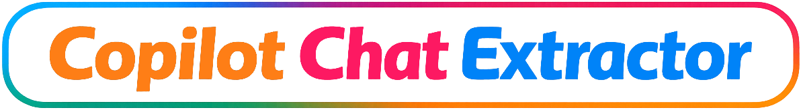
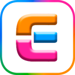
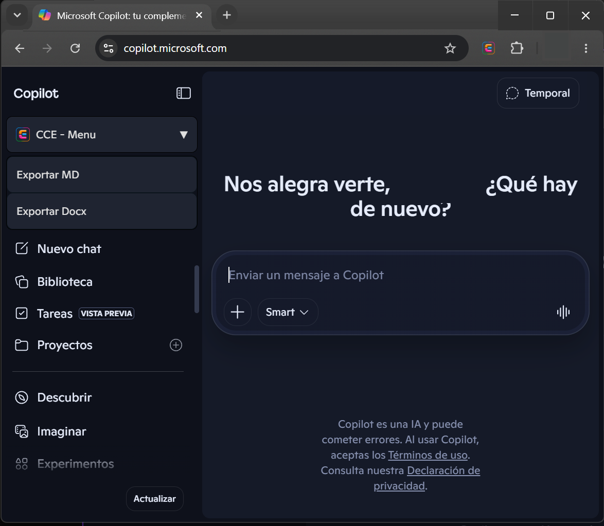
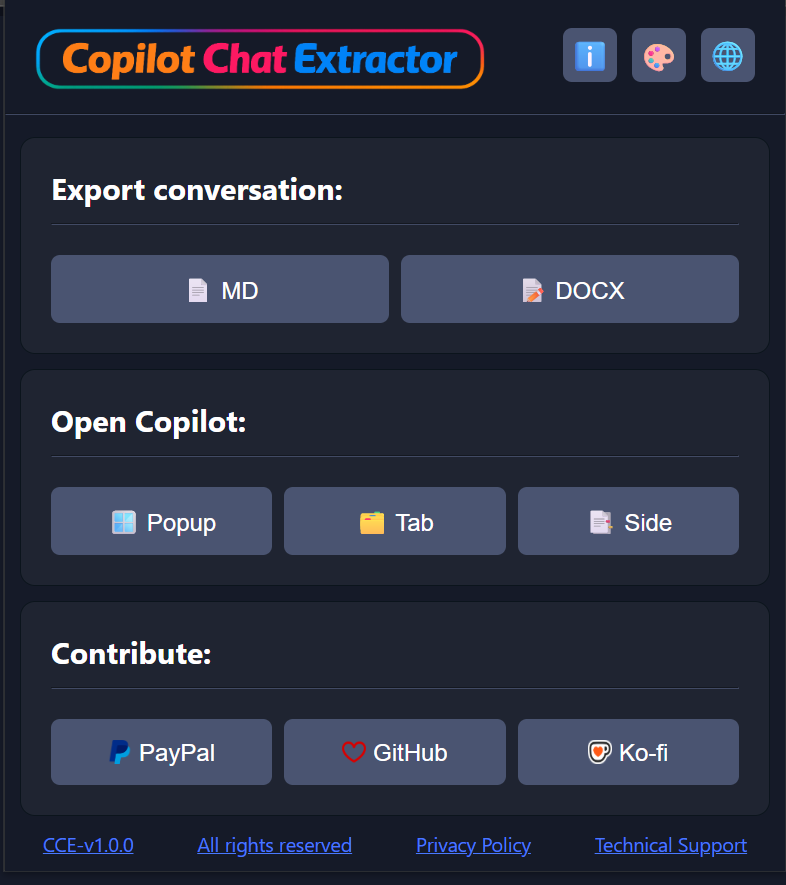
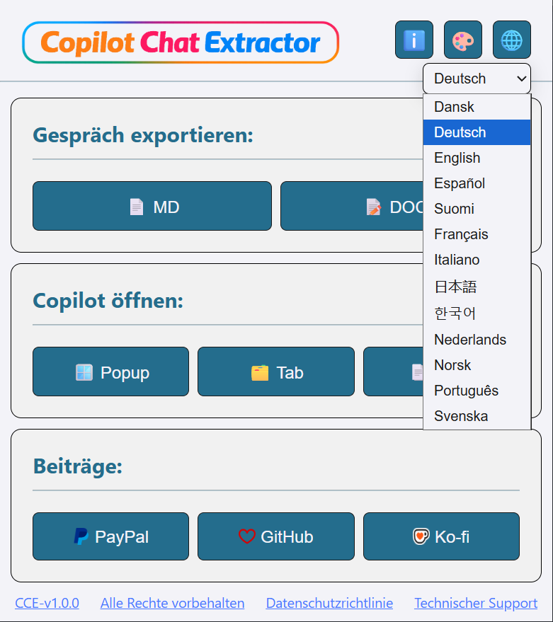
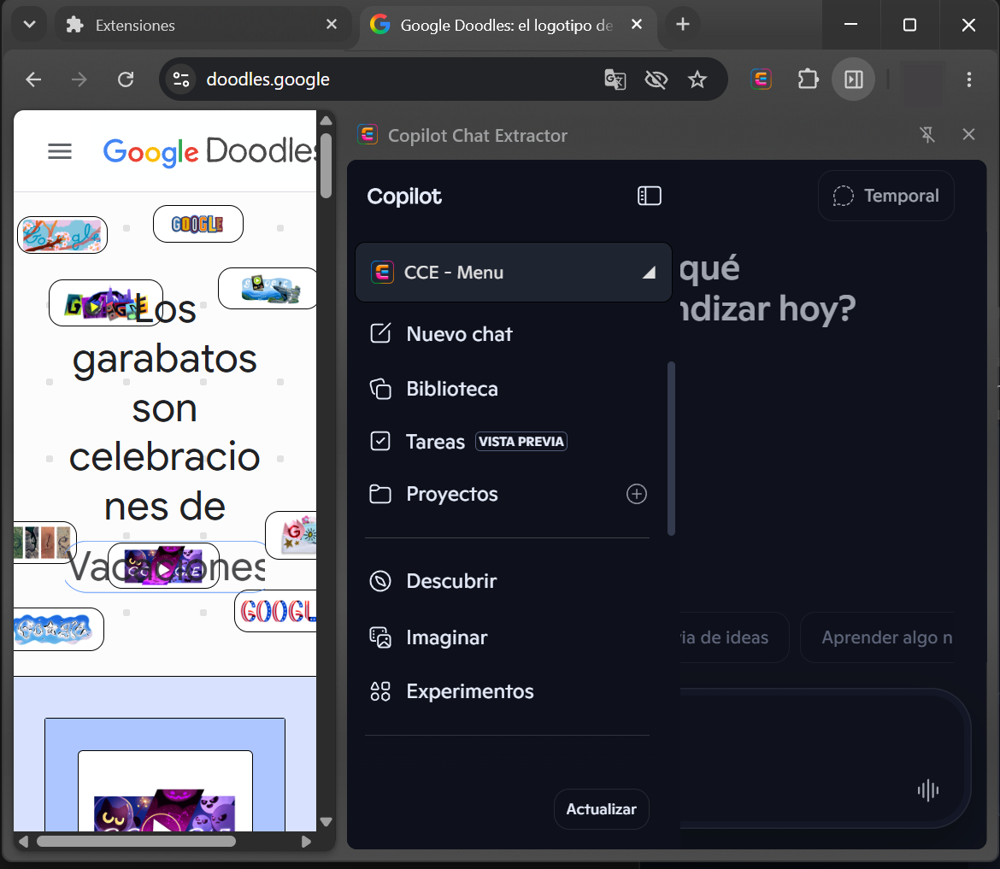
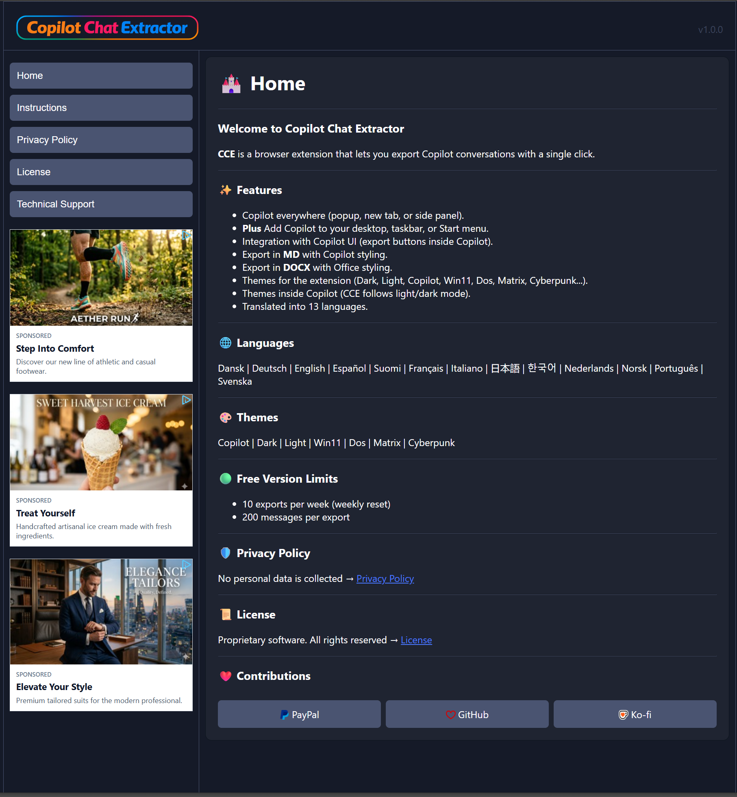
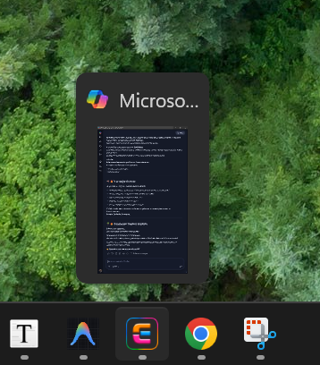
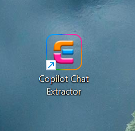

<!--Template repository to create new repositories.
Fill the content whith any you want.-->

   

 

   
<!-- Badges - Replace projectName with the name of the project also, change or add the link-->

 

#  Copilot Chat Extractor

**CCE** is a browser extension that lets you export **Copilot conversations** in one click.

- User‑friendly, multi-language, multi-theme, multi‑format, and fully integrated into Copilot.
- Rich formatted documents with tables, code blocks, lists, links, timestamps...
- No more scrolling, no more limits: real automated exports for real productivity.
- New powerful features are coming soon...

## 📥 Downloads

- Download and install the latest **CCE-Extension.zip** → [Releases](../../releases).
- Or install **CCE** directly from **Chrome Web Store** → **(Coming soon)**

## 🛟 Need help?

- Read how to install and use **CCE** → [Instructions](./INSTRUCTIONS.md).
- Find some answers on this section → [FAQ](./FAQ.md).
- Other issues, questions, or suggestions → [Issues](../../issues).

> **Note:** Use English as the communication language for community support.

## 📸 Screenshots

## ✨ Features

- **Everywhere** → Open Copilot in a pop-up window, new tab, or side panel.
- **Plus** → Add Copilot to desktop, taskbar, and Start Menu.
- **Copilot UI** → Export buttons inside Copilot.
- **Export MD** → Export in Markdown with Copilot style flavor.
- **Export Docx** → Export in Word / LibreOffice with a more office style.
- **Rich format** → Documents with tables, code blocks, lists, links, timestamps...
- **Themes CCE** → Dark, Light, Copilot, Win11, Dos, Matrix, and more...
- **Themes Copilot** → CCE menu follows Copilot dark/light themes.
- **Translations** → Available in 13 languages

## 🌍 Languages

- Dansk | Deutsch | English | Español | Suomi | Français | Italiano | 日本語 | 한국어 | Nederlands | Norsk | Português | Svenska

## 🎨 Themes

- Copilot | Dark | Light | Win11 | Dos | Matrix | Cyberpunk

## 🛡️ Privacy Policy

- This extensión don´t collect personal data → [Privacy Policy](./PRIVACY-POLICY.md).

## 📜 License

- This software is proprietary. All rights reserved → [License](./LICENSE.md).

## ❤️ Contributions

- Any contribution is welcome. Many thanks!!

   <Table>
      <th>Paypal</th>
      <th>Github</th>
      <th>Ko-Fi</th>
     <tr>
      <td></td>
      <td></td>
      <td></td>
     </tr>
   </table>
